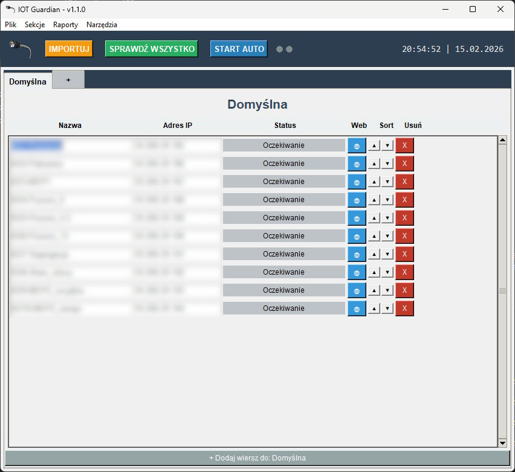

# IOTCheckerApp 🛡️
Zaawansowane narzędzie desktopowe (GUI) do monitorowania stanu urządzeń sieciowych (IOT, PLC, Kamery) w czasie rzeczywistym. Oferuje auto-ping, raporty PDF, powiadomienia e-mail oraz bezpieczne szyfrowanie haseł.

IOTCheckerApp to profesjonalna aplikacja desktopowa napisana w Pythonie, służąca do zarządzania i monitorowania dostępności urządzeń w sieci lokalnej (np. sterowniki PLC, kamery, systemy KD, drukarki). Program pozwala na organizację urządzeń w zakładkach, automatyczne sprawdzanie ich statusu (Ping) oraz generowanie raportów.

<div align="center">
  
</div>

## 🚀 Kluczowe Funkcje

* **Monitoring Real-Time:** Ręczne lub automatyczne sprawdzanie statusu (Online/Offline) przy użyciu pakietów ICMP.
* **Organizacja:** System zakładek pozwalający grupować urządzenia (np. wg działów).
* **Raportowanie:**
    * Generowanie profesjonalnych raportów **PDF** z logo firmy.
    * Automatyczne **powiadomienia e-mail** (SMTP) o stanie sieci (raporty dzienne).
* **Bezpieczeństwo:** Hasła do poczty i administratora są szyfrowane (AES-256 / SHA-256).
* **Interfejs:**
    * Wizualizacja aktywności sieci (animowane diody LED).
    * Szybki dostęp do panelu web urządzenia (przycisk 🌐).
    * Licznik importu i intuicyjne zarządzanie listą.
* **Import/Eksport:** Łatwe przenoszenie konfiguracji i list urządzeń.

## 🛠️ Technologie

Projekt został zbudowany przy użyciu:
* **Python 3.x**
* **Tkinter** (Interfejs graficzny GUI)
* **ping3** (Natywna obsługa ICMP)
* **ReportLab** (Generowanie PDF)
* **Cryptography** (Szyfrowanie Fernet/AES)
* **Pillow** (Obsługa grafiki)

## 📦 Instalacja i Uruchomienie

1. Sklonuj repozytorium:
   ```bash
   git clone https://github.com/phatterit/IOTCheckerApp.git
2. Zainstaluj wymagane biblioteki:

   ```bash
    pip install -r requirements.txt

3. Uruchom aplikację:

   ```bash
    python main.py

## 📜 Licencja
Ten projekt jest udostępniony na licencji MIT. Szczegóły w pliku LICENSE.

Powered by hatterp & AI
   
